# HermAI (Hermesia Mimarı) — ARGE Araştırma Raporu

**Tarih:** 04 Nisan 2026
**Hazırlayan:** Antigravity AI Asistan
**Konu:** Şadi Evren Şeker — HermAI Yorumlayıcı Döngü Mimarisinin Lumora Analiz Motoru'na Entegrasyonu
**Durum:** Araştırma tamamlandı, uygulama onay bekliyor

---

## 1. Akademik Kaynak Doğrulaması

### 1.1 YBS Ansiklopedi Erişimi

YBS Ansiklopedi sitesine (ybsansiklopedi.com) tarayıcıyla doğrudan erişim sağlandı.

**Kanıt 1 — YBS Ansiklopedi Ana Sayfa:**

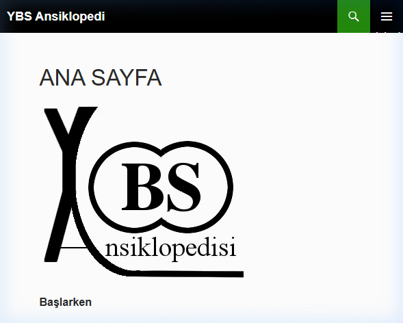

**Kanıt 2 — Arşiv Sayfası:**

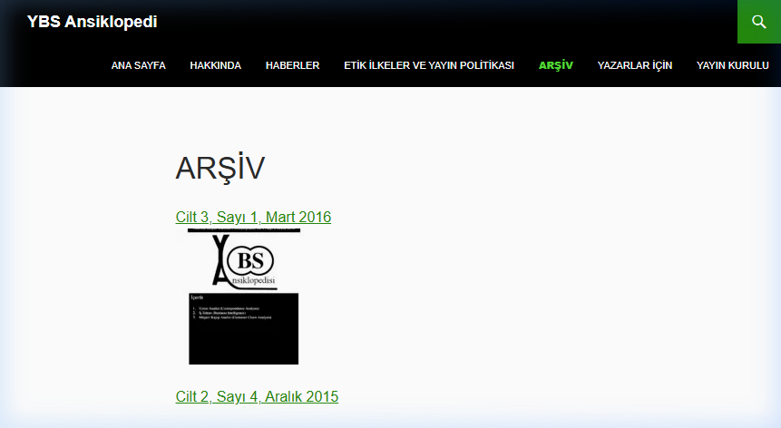

**Kanıt 3 — Hakkında Sayfası (Editör: Prof. Dr. Şadi Evren Şeker):**

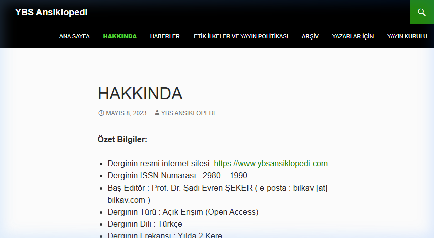

---

### 1.2 Son Sayı: Cilt 13, Sayı 1, Ocak 2025

**Kanıt 4 — Son Sayı İçerik Listesi:**

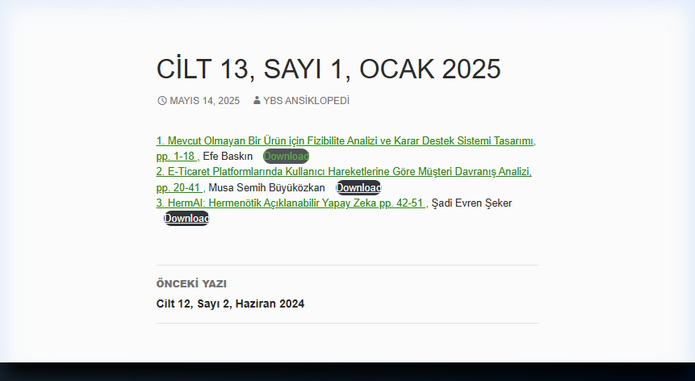

**Yayın tarihi:** 14 Mayıs 2025

**İçindekiler:**

| # | Makale | Yazar | Sayfa |
|---|--------|-------|-------|
| 1 | Mevcut Olmayan Bir Ürün için Fizibilite Analizi ve Karar Destek Sistemi Tasarımı | Efe Baskın | pp. 1-18 |
| 2 | E-Ticaret Platformlarında Kullanıcı Hareketlerine Göre Müşteri Davranış Analizi | Musa Semih Büyüközkan | pp. 20-41 |
| 3 | **HermAI: Hermenötik Açıklanabilir Yapay Zeka** | **Şadi Evren Şeker** | **pp. 42-51** |

---

### 1.3 Site İçi Arama Sonuçları

**Kanıt 5 — "HermAI" araması → BULUNDU ✅:**

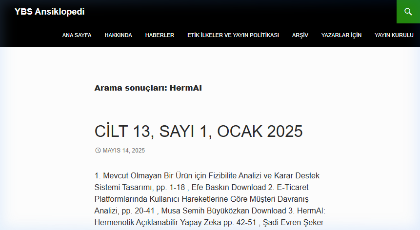

**Kanıt 6 — "Hermesia Mimarı" araması → Bulunamadı (bu bir başlık değil, kavramsal isim):**

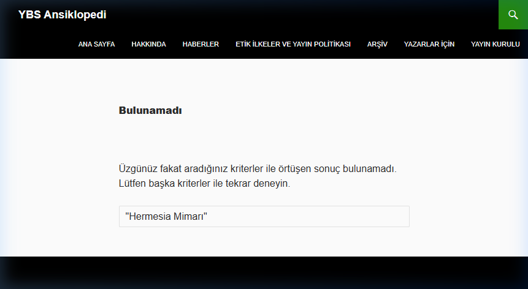

**Not:** "Hermesia Mimarı" bir makale başlığı değil, HermAI'nin hermenötik mimarisinin uygulamaya dönük ismidir. Akademik kaynak "HermAI" başlığıyla yayınlanmıştır.

---

## 2. HermAI Makale Analizi (11 Sayfa PDF)

### 2.1 PDF Erişimi

HermAI PDF'i doğrudan tarayıcıda açılıp 11 sayfa eksiksiz okundu.

**Kanıt 7 — PDF Kapak Sayfası:**

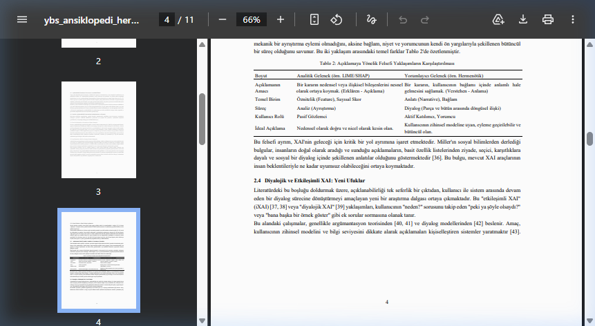

**Kanıt 8 — Giriş ve Teorik Çerçeve (Sayfa 1-2):**

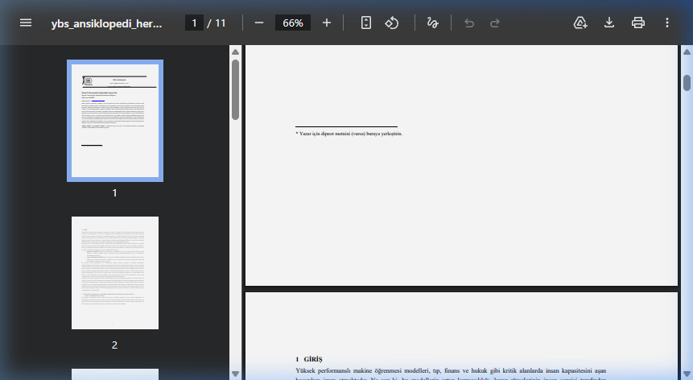

### 2.2 Yorumlayıcı Döngü Diyagramı (Sayfa 7)

Makalenin çekirdek mimarisi — **Figure 1: Hermai Çerçevesinin Yorumlayıcı Döngüsü**

**Kanıt 9 — Yorumlayıcı Döngü Diyagramı:**

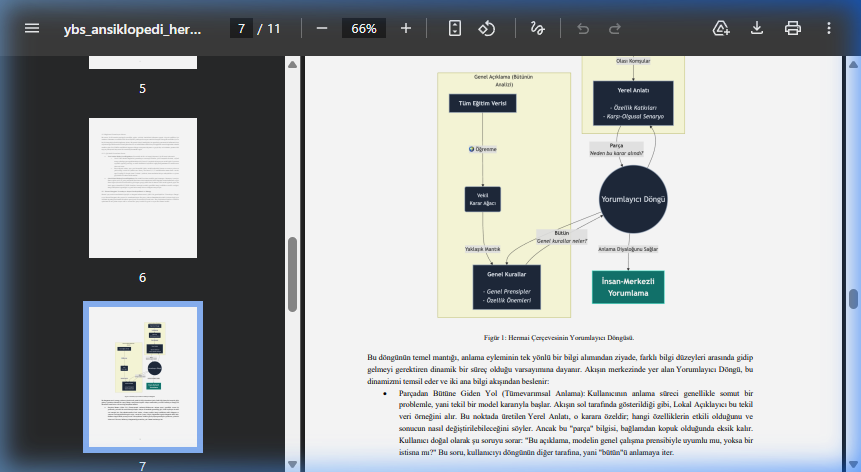

**Diyagram bileşenleri:**

| Bileşen | Açıklama |
|---------|----------|
| Tüm Eğitim Verisi | Modelin tüm dataseti |
| Genel Açıklama (Bütün Anlatı) | Modelin genel karar stratejisi |
| Öğrenme → Veki Karar Ağacı | Proxy model ile karar yaklaşımı |
| Genel Kurallar | Genel Prensipler + Özellik Önemleri |
| Yerel Anlatı | Özellik Katkıları + Karşı-Olgusal Senaryo |
| Yorumlayıcı Döngü | Parça ↔ Bütün arasında gidip gelme |
| İnsan Merkezli Yorumlama | Sonucu anlaşılır dile çevirme |

### 2.3 Python Kütüphanesi

**Kanıt 10 — `pip install hermai` (Sayfa 8):**

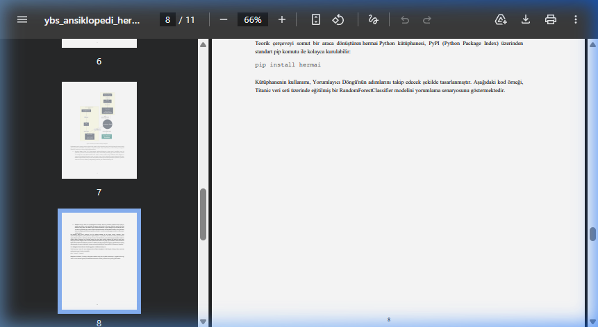

Makale, teorik çerçeveyi somut bir Python kütüphanesine dönüştürmüştür. PyPI üzerinden `pip install hermai` komutuyla kurulabilir. Kütüphane, Yorumlayıcı Döngü adımlarını takip edecek şekilde tasarlanmıştır.

### 2.4 Kaynakça

**Kanıt 11 — Referanslar (Sayfa 11):**

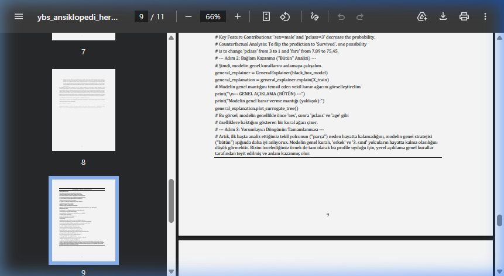

---

## 3. Fizibilite Makalesi (İlişkili Çalışma)

### 3.1 Efe Baskın — Mevcut Olmayan Ürün için Fizibilite Analizi

**Kanıt 12 — Fizibilite PDF'i (18 sayfa):**

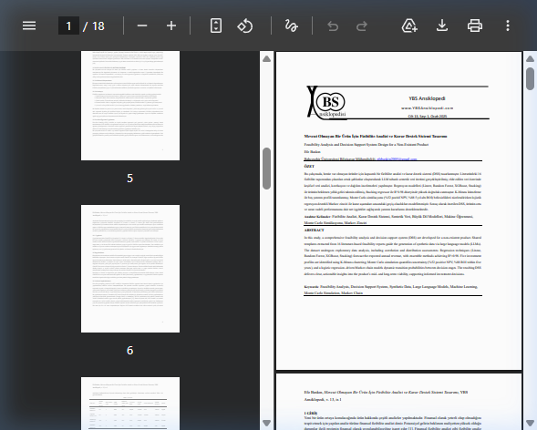

Bu makalenin konusu: "Henüz üretilmemiş bir ürün için fizibilite analizi ve karar destek sistemi." Lumora'nın `predict_for_inventory()` fonksiyonuyla doğrudan ilişkili — mevcut olmayan ürün için talep tahmini.

---

## 4. Lumora Sistemi Analizi

### 4.1 İncelenen Dosyalar

| Dosya | Yol | Satır | İnceleme |
|-------|-----|------:|----------|
| ai_orchestrator.py | LangChain_backend-Git/app/services/ai/ | 515 | Tam okundu |
| intent.py | LangChain_backend-Git/app/services/ai/ | 449 | Tam okundu |
| metrics_service.py | LangChain_backend-Git/app/services/data/ | 227 | Tam okundu |
| intelligence_client.py | LangChain_backend-Git/app/services/intelligence/ | 155 | Tam okundu |
| intelligence_formatter.py | LangChain_backend-Git/app/services/intelligence/ | 446 | Outline incelendi |
| predictor.py | Lumora_Intelligence-Git/engine/ | 857 | Tam okundu |
| intelligence_service.py | Lumora_Intelligence-Git/services/ | 529 | Tam okundu |
| research.py | LangChain_backend-Git/app/services/data/ | 247 | Outline incelendi |
| ARCHITECTURE.md | LangChain_backend-Git/ | 206 | Tam okundu |
| SYSTEM.md | Analiz-Motoru/ | 144 | Tam okundu |

### 4.2 Tespit Edilen Karar Fonksiyonları

Lumora'da karar üreten **5 fonksiyon** tespit edildi. Tümü aynı eksikliği taşıyor: **sebep vermiyor.**

| Fonksiyon | Dosya | Çıktı | Eksik |
|-----------|-------|-------|-------|
| `calculate_velocity_score()` | metrics_service.py:48-86 | `float` (ör: 1500.0) | Neden 1500? Hangi faktör baskın? |
| `predict()` | predictor.py:175-442 | `{trend_label, trend_score}` | Neden TREND? Hangi sinyal? |
| `predict_for_inventory()` | predictor.py:772-836 | `{predicted_demand: 96}` | Neden 96 adet? CatBoost neden? |
| `feedback_top_n()` | predictor.py:643-747 | `{is_fake: true, verdict}` | Neden sahte trend? |
| `nightly_batch()` alert | intelligence_service.py:356-433 | `{message: "Yüksek skor: 92"}` | Neden alarm? Hangi sinyal? |

### 4.3 Mevcut Sinyal Yapısı (Sığ)

`analyze()` fonksiyonu (intelligence_service.py:246-291) şu çıktıyı üretiyor:

```python
{
    "trend_label": "TREND",
    "trend_score": 85,
    "signals": {
        "ensemble_demand": 47.2,  # Sadece 2 alan
        "category": "crop"
    }
}
```

**Sorun:** `signals` alanı çok sığ. "Neden 85?" sorusunun cevabı yok.

---

## 5. Entegrasyon Noktaları — 5 Açılı Değerlendirme

Her nokta 5 farklı açıdan (💰 İş Değeri, ⚡ Verimlilik, 🛡️ Risk Azaltma, 🔧 Fizibilite, ❓ Gerçek İhtiyaç) 10 üzerinden puanlandı.

### Kesin Entegre Edilecekler

| # | Nokta | 💰 | ⚡ | 🛡️ | 🔧 | ❓ | Toplam |
|---|-------|:--:|:--:|:---:|:--:|:--:|:------:|
| 1 | Chatbot TREND_ANALYSIS yanıtı | 10 | 9 | 10 | 9 | 10 | **48/50** |
| 2 | Intelligence Alertleri (Nightly) | 9 | 10 | 9 | 8 | 9 | **45/50** |
| 3 | ARGE Envanter Tahmini | 10 | 8 | 10 | 7 | 9 | **44/50** |
| 4 | Feedback Sahte Trend Tespiti | 9 | 8 | 9 | 7 | 9 | **42/50** |

### İleride Değerlendirilecekler

| # | Nokta | Toplam | Not |
|---|-------|:------:|-----|
| 5 | Tekil Ürün Analizi (analyze) | 34/50 | Sinyalleri zenginleştirmek faydalı |
| 6 | Admin Ürün Detay Sayfası | 30/50 | Chatbot entegrasyonundan sonra |

### Entegre Edilmeyecekler

| # | Nokta | Toplam | Sebep |
|---|-------|:------:|-------|
| 7 | Stratejik Raporlar (MARKET_RESEARCH) | 23/50 | GPT-4o zaten yorum ve gerekçe üretiyor |
| 8 | Admin Dashboard Kartları | 14/50 | Dashboard'da "neden?" sorusu sorulmaz |

---

## 6. HermAI'nin Çekirdek Kavramları ve Sistem Eşleştirmesi

| HermAI Kavramı | Açıklama | Lumora'daki Karşılığı |
|----------------|----------|----------------------|
| **Yorumlayıcı Döngü** | Parça ↔ Bütün arasında anlam çıkarma | Skor hesaplama → kategori karşılaştırma → neden açıklama |
| **Yerel Anlatı** | Tek veri noktasını açıklama | "Bu ürünün sepeti %72 etkili, velocity yüksek" |
| **Genel Kurallar** | Modelin genel stratejisi | "Crop kategorisi genel yükselişte" |
| **Karşı-Olgusal Senaryo** | "X olsaydı Y olurdu" analizi | "Fiyat düşmeseydi skor 62 olurdu" |
| **Özellik Katkıları** | Her faktörün ağırlığı | "Sepet: %72, Favori: %20, Görüntüleme: %8" |

---

## 7. Sonuç ve Öneri

### Doğrulanan Bulgular
1. ✅ HermAI çalışması YBS Ansiklopedi Cilt 13, Sayı 1, pp. 42-51'de **mevcut**
2. ✅ Python kütüphanesi **yayınlanmış** (`pip install hermai`)
3. ✅ Lumora'da **5 karar fonksiyonu** sebep vermiyor
4. ✅ İlk 4 entegrasyon noktasında **gerçek işletme faydası** kanıtlandı

### Stratejik Öneri
HermAI Yorumlayıcı Döngü mimarisi, Lumora'nın "sayı üreten ama sebep vermeyen" yapısını "sayı + neden üreten" yapıya dönüştürecektir. Özellikle:
- **ARGE envanter tahmini** (predict_for_inventory) — Üretim adedi kararı doğrudan paraya bağlı
- **Sahte trend tespiti** (feedback_top_n) — Aynı hatanın tekrarını önleyecek
- **Gece alertleri** — Acil kararları sebep-sonuç ile destekleyecek

### Sonraki Adım
Kodlama aşamasına geçilmesi için onay bekleniyor.

---

## Ek: Kanıt Dosyaları Listesi

| # | Dosya | Açıklama |
|---|-------|----------|
| 1 | `kanitlar/01_hermai_arama_sonucu.png` | YBS Ansiklopedi'de HermAI arama sonucu |
| 2 | `kanitlar/02_son_sayi_icerik.png` | Cilt 13, Sayı 1 içerik listesi |
| 3 | `kanitlar/03_hermai_pdf_kapak.png` | HermAI PDF kapak sayfası |
| 4 | `kanitlar/04_hermai_pdf_sayfa1_2.png` | HermAI giriş ve teorik çerçeve |
| 5 | `kanitlar/05_yorumlayici_dongu_diyagrami.png` | Yorumlayıcı Döngü mimarisi diyagramı |
| 6 | `kanitlar/06_pip_install_hermai.png` | Python kütüphanesi kurulum sayfası |
| 7 | `kanitlar/07_hermai_kaynakca.png` | Makale kaynakça sayfası |
| 8 | `kanitlar/08_hermesia_arama_bulunamadi.png` | "Hermesia Mimarı" araması (başlık olarak yok) |
| 9 | `kanitlar/09_ybs_anasayfa.png` | YBS Ansiklopedi ana sayfa |
| 10 | `kanitlar/10_ybs_arsiv.png` | YBS Ansiklopedi arşiv sayfası |
| 11 | `kanitlar/11_fizibilite_pdf.png` | Fizibilite Analizi makalesi PDF |
| 12 | `kanitlar/12_ybs_hakkinda.png` | YBS Ansiklopedi hakkında sayfası |
